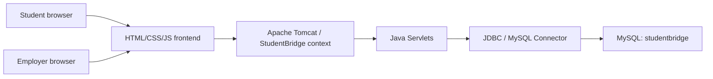

# StudentBridge Architecture

Last updated: 2026-05-01

## Project Overview

StudentBridge is a three-layer web application:

1. A browser-based frontend built with HTML, CSS, and JavaScript.
2. A Java Servlet backend deployed to Apache Tomcat.
3. A MySQL database accessed through JDBC.

The current architecture is intentionally simple for a university capstone MVP. The strongest demo path is local Tomcat with MySQL running on the same machine.

## Main User Flow

1. Student opens the homepage.
2. Student searches available jobs in the frontend job board.
3. Student registers or logs in through a servlet form.
4. Servlet reads/writes user data in MySQL.
5. Student selects a job and, in the planned final flow, submits an application stored in MySQL.

## System Parts

| Part | Purpose | Key files |
|---|---|---|
| Frontend | Displays pages, navigation, job search, and forms. | `index.html`, `frontend/jobsearch.html`, `frontend/login.html`, `frontend/register.html`, `frontend/style.css`, `frontend/script.js` |
| Backend | Handles registration, login, servlet sessions, and future job/application logic. | `Backend/RegisterServlet.java`, `Backend/LoginServlet.java`, `Backend/DBConnection.java` |
| Database | Stores users now; should store jobs and applications next. | MySQL database `studentbridge` |
| Deployment | Compiles Java classes and copies frontend/backend artifacts into Tomcat. | `deploy.sh`, `bin/`, `server/*.jar` |
| External APIs | None currently required. | Future: maps, email, or notification services |

## Architecture Diagram



## Frontend Explanation

The frontend is made of static pages and in-page JavaScript.

| Page | Purpose | Current behavior |
|---|---|---|
| `index.html` | Homepage and product story | Working navigation and calls to action. |
| `frontend/jobsearch.html` | Job list and filtering | Uses seeded JavaScript job data; not connected to MySQL yet. |
| `frontend/register.html` | User registration form | Posts form data to the register servlet. |
| `frontend/login.html` | User login form | Posts email/password to the login servlet. |

## Backend Explanation

The backend uses annotated Java Servlets.

| Servlet/class | Purpose | Current behavior |
|---|---|---|
| `RegisterServlet` | Creates users | Reads form fields, checks password confirmation, inserts user into MySQL, redirects to login. |
| `LoginServlet` | Authenticates users | Checks email/password in MySQL, creates `HttpSession`, redirects to homepage. |
| `DBConnection` | Opens database connection | Loads MySQL JDBC driver and connects to local database. |
| `TestDB` | Local connection check | Calls `DBConnection.getConnection()`. |

## Database Explanation

The current servlet code expects:

```sql
CREATE DATABASE IF NOT EXISTS studentbridge;

CREATE TABLE IF NOT EXISTS users (
  id INT AUTO_INCREMENT PRIMARY KEY,
  name VARCHAR(100) NOT NULL,
  email VARCHAR(255) NOT NULL UNIQUE,
  phone VARCHAR(30),
  password VARCHAR(255) NOT NULL,
  created_at TIMESTAMP DEFAULT CURRENT_TIMESTAMP
);
```

The final MVP should add:

| Table | Purpose |
|---|---|
| `jobs` | Store employer job posts instead of hard-coded frontend jobs. |
| `applications` | Store student applications to jobs. |
| `employers` or `profiles` | Store employer/student-specific profile details if account roles become separate. |

## Request Flow

### Registration

```text
Browser register form
-> POST /StudentBridge/RegisterServlet
-> RegisterServlet
-> DBConnection
-> INSERT INTO users
-> redirect to login page
```

### Login

```text
Browser login form
-> POST /StudentBridge/LoginServlet
-> LoginServlet
-> DBConnection
-> SELECT user by email/password
-> create HttpSession
-> redirect to homepage
```

### Job Search

```text
Browser job page
-> local JavaScript filters seeded job array
-> results render in the page
```

## Important Files

| File/folder | What it does | Owner who can explain it |
|---|---|---|
| `index.html` | Homepage and main navigation | Mezbah |
| `frontend/jobsearch.html` | Job list, filters, and current Apply placeholder | Sami / Ali Ashraf |
| `frontend/register.html` | Registration form | Mezbah |
| `frontend/login.html` | Login form | Mezbah / Ali Ashraf |
| `Backend/RegisterServlet.java` | Registration backend | Mezbah |
| `Backend/LoginServlet.java` | Login backend | Ali Ashraf / Mezbah |
| `Backend/DBConnection.java` | MySQL connection | Mezbah |
| `deploy.sh` | Tomcat deployment script | Team |
| `docs/` | Capstone evidence and handoff documents | Guramg / Team |

## Risks / Known Weak Areas

| Risk | Impact | Mitigation |
|---|---|---|
| Hard-coded database credentials | Unsafe for public repo and difficult for teammates | Move to local config or environment variables before public deployment. |
| Plain-text passwords | Security risk | Add password hashing before real users. |
| Absolute form action paths | Forms may post outside the Tomcat context | Test under `/StudentBridge` and update form action paths if needed. |
| Job data is frontend-only | Cannot add real employer jobs yet | Create `jobs` table and servlet/API for job listing. |
| Application flow is placeholder | Midterm demo cannot show full apply storage yet | Use backup demo and implement application servlet next. |
| Limited tests | Bugs may appear during demo | Use manual test checklist and add repeatable database tests. |

## AI-Assisted Areas

| Area | AI helped with | Human review evidence |
|---|---|---|
| UI layout and copy | Drafted page structure and styling ideas | `[TODO: link PR/review showing human edits]` |
| Servlet/JDBC examples | Helped draft connection and form handling patterns | `[TODO: link PR/review showing tests]` |
| Documentation | Helped organize capstone docs and audit language | `[TODO: link documentation PR]` |

## How to Extend Safely

1. Create a GitHub issue before changing a feature.
2. Make a branch and use a pull request.
3. Add or update the database schema notes in `docs/SETUP_GUIDE.md`.
4. Test locally through Tomcat, not only by opening HTML files directly.
5. Add real evidence links to sprint packets and demo notes.
6. Keep the stack as Java Servlet + Tomcat + MySQL unless the instructor approves a change.
